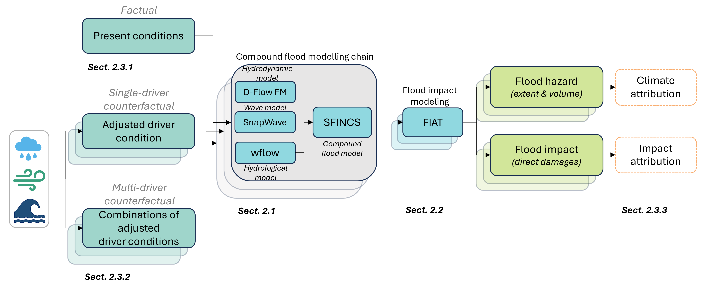
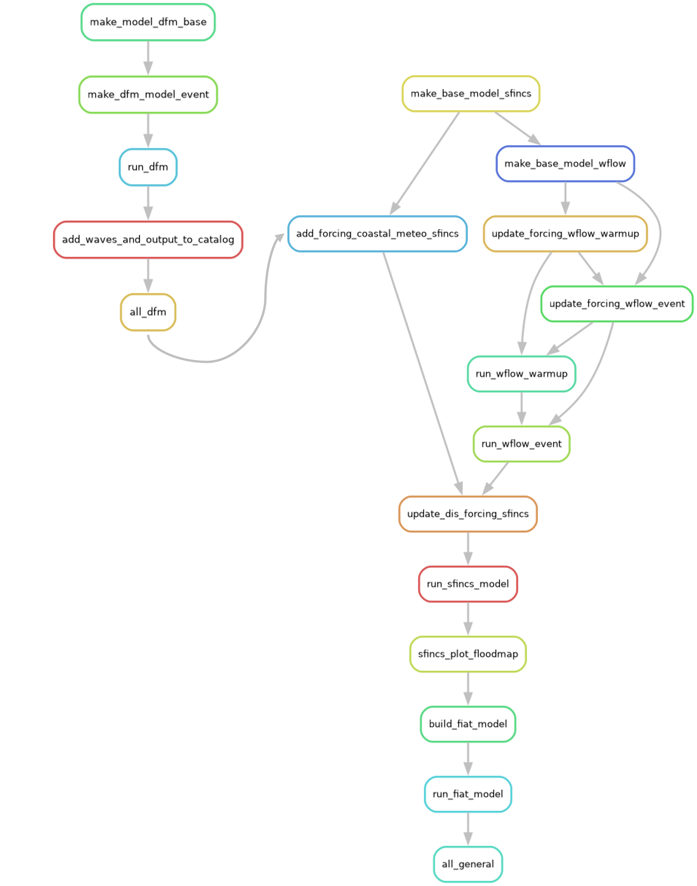

# Compound Flooding Modeling for Tropical Cyclones

This work is part of the paper Vertegaal et al. (submitted) and Work Package 1 of the COMPASS project whose overarching objective is to characterise compound extremes in current and future climates. COMPASS (COMPound extremes Attribution of climate change: towardS an operational Service) aims to develop a harmonized, yet flexible, methodological framework for **climate and impact attribution** of various complex **extremes** that include compound, sequential and cascading hazard events. For more information and useful links about the project, have a look at the introduction on the [COMPASS Github repository](https://github.com/HORIZON-COMPASS)


## Description
This repository contains workflows to setup a global-to-local modelling chain for the hazard and impact modelling of tropical cyclone (TC) Idai. More specifically, it contains specific workflows to setup a hydrological model (wflow), a coastal hydrodynamic model (Delft3D-FM), a local compound flooding model (SFINCS), and a flood impact model (Delft-FIAT) for the sofala province in Mozambique. Each model is setup through a separate workflow and provide boundary conditions for a specific TC driver to be considered to model local compound flooding. A final workflow combines all the separate workflows together for the local compound flood model setup. The workflows are created using the [snakemake](https://snakemake.readthedocs.io/en/stable/) package and [hydroMT](https://deltares.github.io/hydromt/stable/) model builders for wflow ([hydroMT-Wflow](https://deltares.github.io/hydromt_wflow/latest/)), SFINCS ([hydromt-sfincs](https://deltares.github.io/hydromt_sfincs/latest/)), Delft-FIAT ([hydromt-fiat](https://github.com/Deltares/hydromt_fiat)), and the Python [dfm-tools](https://deltares.github.io/dfm_tools/) for the Delft3D-FM model. All the input datasets are defined in a data catalog and specific model parameters and other pre-processing steps in a configuration file, both are .yml files. Data to generate all figures is still to be added. To create the results presentd in Vertegaal et al. (submitted), you can un the scripts in the Attribution_results folder, where another README explains which scripts is needed for which result.



# This code is specifically for the climate and impact attribution of TC Idai but can be applied to other flood events.

## Installation instructions
### Prerequisite
Make sure you have [Git](https://github.com/git-guides/install-git) installed. You will also need [pixi](https://pixi.sh/latest/#installation) to install the required dependencies (defined in specific environments). We suggest using [Visual Studio Code](https://code.visualstudio.com/) to browse through the code, develop and open the Jupyter notebooks (optional).

### Installation
In order to use the workflows, you will need to clone this repository and install the dependencies required to run the code. 
1. Open a terminal and clone this repository: `git clone https://github.com/HORIZON-COMPASS/compound-flooding-tropical-cyclones/attribution_TC_Idai.git`
2. Navigate to the project directory: `cd compound-flooding-tropical-cyclones`
3. Install dependencies: `pixi install`. This will install all the environments required to run all the workflows. To install only specific environments, mention it, for example : `pixi install compass-sfincs`. All the enviroments available are listed [environments] in the pixi.toml file
   
## How to run
At the moment, seven snakemake workflow files are present. All workflows work both on Linux as well as on Windows. A workflow consists of a set of rules to be executed in a specific order. All specific workflow configuration settings are prescribed in a configuration file (a .yml file).

- **snakefile_sfincs_build.smk**: This workflow builds a SFINCS model without adding any forcing yet. The workflow consists of just one rule.
- **snakefile_wflow.smk**: This workflow builds a wflow model, using the SFINCS region as input. Gauges are added on the SFINCS inflow points, in order to generate output at the correct locations. Precipitation forcing is added based on the event start and end time. First, the wflow model is warmed up for a period of 1 year, with daily ERA5 data. The event itself is run with ERA5 hourly precipitation and tmeperature forcing data as given in the snakemake configuration file. Both factual and counterfactual precipitation can be provided as input.
- **snakefile_wflow_30yr.smk**: This workflow builds a 30-year long wflow model, ending at the start of the TC event, using the wflow base model as input. The bankfull discharge (2-year return period) is based on this 30-year long simulation and removed from the wflow generated discharge for the event, before added as discharge boundary condition to SFINCS.The remain incoming discharge represents the out of banks discharge, thereby removing the need to burn in an (unknown) river conveyance in the DEM. For this purpose, the same gauges as the wflow model for the event are used, in order to generate output at the correct locations. Precipitation forcing is added based on the event start time and exactly 30 years prior. The 30-year wflow model is run with daily ERA5 data for precipitation and temperature.
- **snakefile_dfm.smk**/**snakefile_dfm_cluster.smk**: This workflow creates a dfm base model on windows or linux (_cluster) and updates it by adding forcing data and running the model simulations. Afterwards, wave setup results from a SFINCS-SnapWave simulation is added to the DFM output. The output is added to a data catalog which can be used as SFINCS waterlevel forcing. Both factual and counterfactual sea level and wind speed can be provided as input.
- **snakefile_sfincs_update.smk**: This workflow updates the SFINCS model by adding forcing data and running the model simulations. It handles the addition of meteorological, coastal and discharge forcing data; executes the model, and generates the output. Both factual and counterfactual precipitation, sea level and wind speed can be provided as input.
- **snakefile_all_wflow_sfincs.smk**: This workflow combines the wflow and sfincs into one large workflow. Combining all workflow is not possible due to conflicting packages and the need for one overarching pixi environment. You can use this snakefile instead of the one mentioned shortly. The sequence of the workflows are: 
snakefile_sfincs_build.smk > snakefile_wflow.smk > snakefile_sfincs_update.smk
- **snakefile_fiat.smk**: This workflow builds and runs the Delft-FIAT model to estimate flood damage, based on the floodmap generated by the SFINCS simulations. 

All snakemake workflows use the same configuration file: config_snakemake/config_general_MZB.yml.

Here is a visual overview of the combined workflows:


We provide examples on how to run each workflow in specific Jupyter notebook in the docs folder. Building the workflow requires the same general steps in snakemake, summarized below.
 1. Activating the environments to load all the required dependencies
 2. Navigate to the folder where the workflows are located (or make sure that you use the correct path afterwards)
 3. Creating a picture showing the workflow with the rules and their order to make sure the workflow is doing what is intended (optional)
 4. Unlocking the working directory in order to save the results of the workflow
 5. Running the workflow

This translate to the following command lines in the terminal, taking as an example the snakefile_wflow.smk workflow:
```
conda activate compass-wflow
cd Workflows
snakemake -s snakefile_wflow --configfile config_snakemake/config_general_MZB.yml  --dag | dot -Tpng > dag_all.png
snakemake --unlock -s snakefile_wflow --configfile config_snakemake/config_general_MZB.yml
snakemake all -c 1 -s snakefile_wflow --configfile config_snakemake/config_general_MZB.yml
```

There exist many snakemake commad line options that are worth exploring. The complete list is is on the [CLI documentation](https://snakemake.readthedocs.io/en/stable/executing/cli.html) but below are a few useful ones:
- **-s**: selection of the snakefile workflow to run.
- **--configfile**: name of the config file with the model and climate options.
- **-c**: number of cores to use to run the workflows (if more than 1, the workflow will be parallelized).
- **--dry-run**: returns the list of steps (rules) in the workflow that will be run, **without actually running it**. This is useful to test whether the workflow will work as intended. 

## Acknowledgements

 The COMPASS project has received funding from the European Union’s HORIZON Research and Innovation Actions Programme under Grant Agreement No. 101135481

Funded by the European Union. Views and opinions expressed are however those of the author(s) only and do not necessarily reflect those of the European Union or of the European Health and Digital Executive Agency (HADEA). Neither the European Union nor the granting authority HADEA can be held responsible for them.
