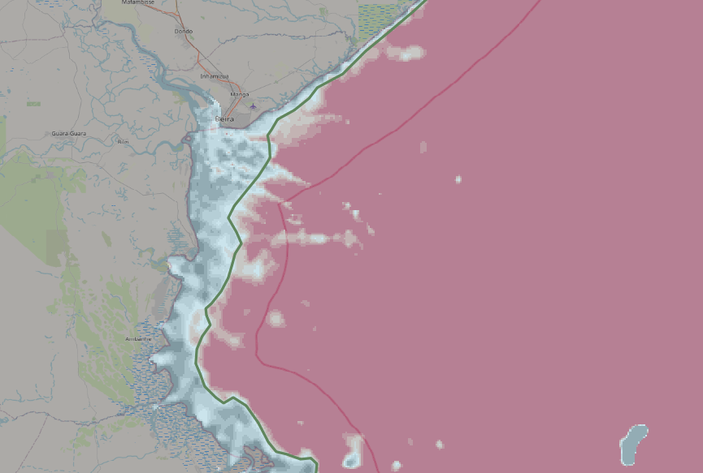
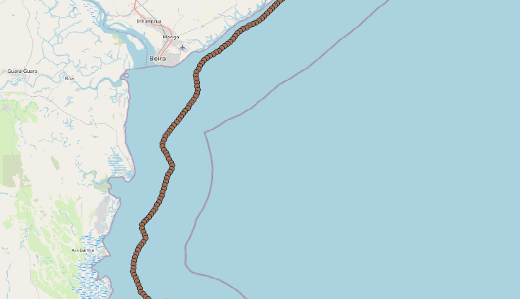
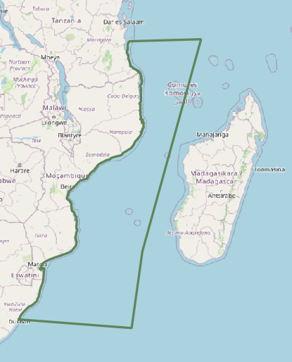
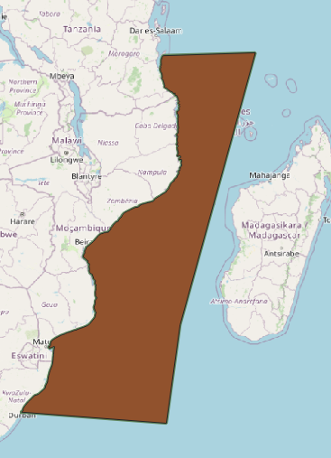

# Coastal coupling mask

To facilitate coupling between the coastal hydrodynamic model (Delft3D-FM) and the flood model (SFINCS), we need to define the location of the coupling and generate the necessary data files. Two files are needed:  
 - Observations points where the output of the Delft3D-FM model will be saved;
 - Polygon that will be used to mask out the offshore area when defining the SFINCS modelling domain based on a rectangular bounding box.

 The tutorial below explains how to generate these files for a location of choice. The steps are executed using free open-source software [QGIS](https://qgis.org/).

## Step 1 - Bathymetry data
The coupling between the hydrodynamic model and the flood model would ideally be located along an isobath (constant water depth) close to the shore. In this example we define the coupling at the 5mMSL isobath (5 m water depth).

We will need to use a bathymetry dataset in order to generate this isobath, this should be the dataset that will be used to define the bathymetry in the Delft3D-FM model. In this example we use the GEBCO 2024 bathymetry. We download the bathymetry for the area covering the area of interest via the [GEBCO data portal](https://download.gebco.net/) by specifying the coordinate box and selecting the NetCDF format to download the data. 

After saving this data locally, we need to load this data into QGIS. In a QGIS project you can select Layer -> Add layer -> Raster and select the bathymetry dataset in the .nc format.

Now, in order to easily visualize the -5mMSL isobath, go to the properties of the bathymetry data layer and set the colorbar to Pseudocolor. Set the colorbar limits to -10 to 0 (or another range centered around -5m - you may need to experiment with choosing the limits to obtain a clear isobath, which will depend on the steepness of the bathymetry). Choose a divering colorbar, such as the red-white-black colorbar. Now you should be able to clearly see where the -5m isobath is located.

## Step 2 - Creating a polyline along the isobath 
We can create a polyline tracing the isobath. To do this, create a new vector layer (Shapefile) with LineString geometry format. Click a new polyline along the -5mMSL isobath along the entire domain that is relevant for your model. 

In case the bathymetry is complex and the isobath does not form a smooth line (such as in the image below), you can click an approximate line that captures the main features. It is best to avoid creating sharply curving lines as this line will also be used to define the outer boundary of the flood model.

  

## Step 3 - Observation points for the hydrodynamic model
We will create a shapefile containing evenly spaced points along the polyline to be used as output locations for the Delft3D-FM model.

Having selected the layer containing the newly created polyline, go to Processing -> Toolbox -> Vector geometry -> Points along geometry.

In the Points to Geometry tool, select the layer with the polyline and specify the desired spacing of the points along this line. This spacing can be of similar order of magnitude as the resolution of the hydrodynamic model in the coastal area. In this example we use a spacing of 1 km (approx. 0.01 degrees). As output location, opt for saving the resulting file as a new shapefile.

## Step 4 - Coastal mask
Now we can create the polygon for the coastal mask that is needed to define the computational domain of the flood model.  

We can again select the layer containing the polyline along the isobath (LineString format). Enable layer editing, and select the Vertices tool. Add new points starting at one end of the polyline in order to create a closed polygon-like shape extending into deep water further from the coast. This area will be used to mask out the coastal waters beyond the Delft3D-FM output points when setting up the flood model. It is best to let this selection extend far into the offshore waters to make sure the mask will be sufficient to exclude open water from any flood model extent that may be used in the flood model setup, see example in the image below. 

At this stage we have a polyline outlining the coastal mask, but this is not yet a closed polygon. We can convert this polyline to a polygon by going to Vector -> Geometry -> Lines to polygons tool. As an output file, specify the desired file name and choose format .geojson. Once the operation is executed, you should have a .geojson file containing your polygon saved to the disk.

## Step 5 - Adding observation points and mask to data catalog

Now we can add both the points along the coastline and the polygon data files to the data catalog which will be read when executing the workflow. 

As an example, see the following data catalog entries in the datacatalog_SFINCS_coastal_coupling.yml:

- **Points:** coastal_coupling_DFM_obs_points_MZB
- **Polygon:** coastal_coupling_msk_MZB 

Make sure to include the handles to these datasets in the model configuration files under *dfm_obs_file* for the Delft3D-FM output points and under *exclude_mask* in the SFINCS domain definition.

*Author: n-aleksandrova*